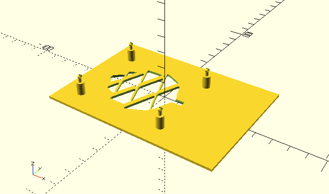

# Mount Plate Generator module
An [OpenSCAD](http://www.openscad.org) module for creating mount plates.

This is designed for creating mount plates for SOC computer PCB boards.
But it is generic enough that it should be able to create any type of mounting plate.

Current version on [GitHub](https://github.com/snemetz/OpenSCAD-Modules/tree/master/pcb-mount-plate)

Customizable version will be created once I finish initial designs and some testing.
[Thingiverse copy](http://www.thingiverse.com/thing:1533164)

**To use this you must also download my standoffs module.**
This will be true until I write a customizer version.
But if you're getting this from github, I'd recommend getting the
non-customizer version as it is likely to be more current.

### Design Notes

Cutout designs were created by:
1. Finding logo image on Internet
2. Using Paint.net to convert image to black & white and manually modify to make printable
3. Using Inkscape to trace image and convert to OpenSCAD code

It was done this way instead of creating importable image designs, so it can work in customizer later

