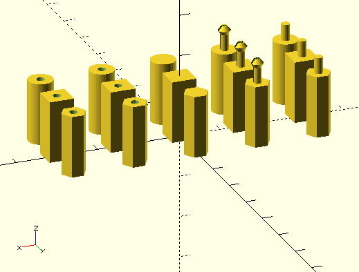

# Standoff Generator module
An [OpenSCAD](http://www.openscad.org) module for creating standoffs

[Thingiverse customizable copy](http://www.thingiverse.com/thing:1528494)

Initial code refactored from:
  [eriqjo's Standoff Customizer v1.0](http://www.thingiverse.com/thing:351092)
  and Kevin Osborn's Snap in PCB Standoff
